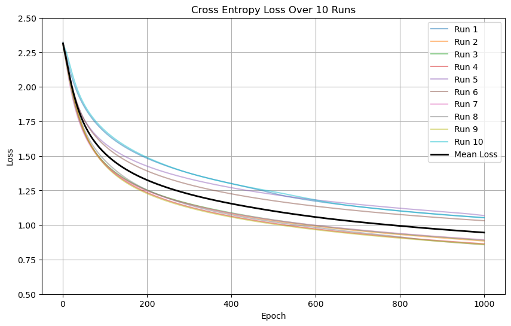
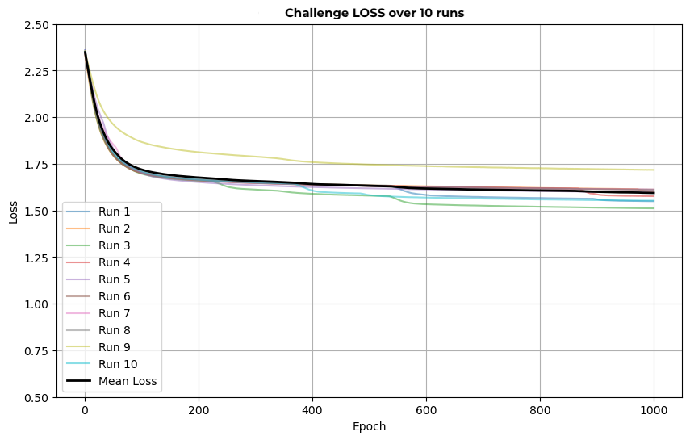
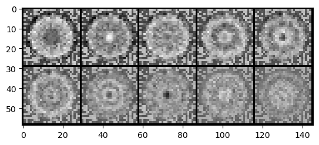
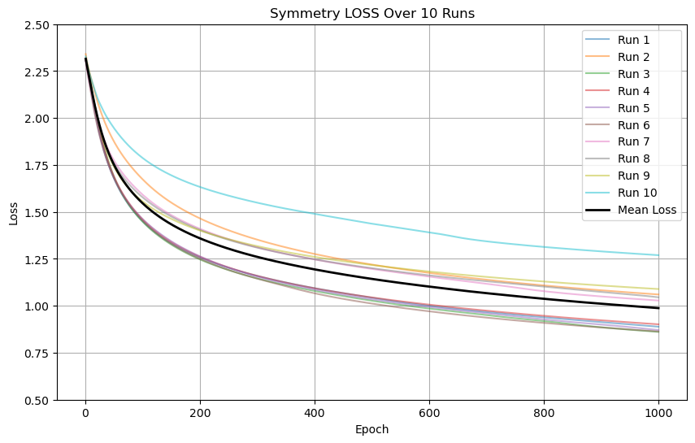
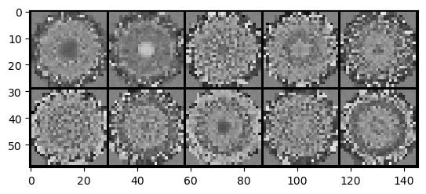

## Discovery Symmetries in Data
### Symmetry Regularization on MNIST dataset under rotation trasformations

This is the first attempt to implement a Fully Connected 1 layer neural network (`number of neurons = 728`) multiclass classification problem that is invariant to the rotation of the MNIST dataset over a certain angle (in my analysis I selected an angle of 3 degree) and to compare the results with the same network but with different regularization terms, in particular:

- the *FCNN* with only the cross entropy loss. (**The CE LOSS**)
- the *FCNN* with the cross entropy loss and the regularization term for the challenge (**The Challenge LOSS**)
- the *FCNN* with the cross entropy loss and the Symmetry-Adapted Regularization terms (**The Symmetry LOSS**)

Most of the functions used are inside the file `./functions.py`

The parameters used are:
- `n_epochs = 1000`
- `angle_rotation = 3 degree`
- `cardinality = 120` (360/angle_rotation)
- `batch_size_training = 6120` (6000 random rotated images + 120 atoms that is the orbit of 1 image selected randomly)
- `barch_size_test = 1120` (1000 random rotated images + 120 atoms that is the orbit of 1 image selected randomly)
- `learning_rate = 0.001`
- `lambda_reg=0.01`
- `lambda_symm=0.01`
- `lambda_comm=0.01`
- `lambda_symm_comm=0.01`
- `sigma_squared=0.001` (in order to compute the symm_loss)

Notes: 
These results are obtained using the best model weights over 10 runs over 1000 epochs.
The plots of the Loss functions and the weight matrices of first layer are saved inside the folder `./img`
The weights of the best performing Loss for each analysis are saved in the folder `./best_model_weights`

# The CE LOSS

For this Loss it was mplemented only the [the cross entropy loss](https://pytorch.org/docs/stable/generated/torch.nn.CrossEntropyLoss.html) 

- Train Accuracy: 73.51%
- Test Accuracy: 53.66%
- Invariance evaluation:
  - Average Euclidean norm of the difference: 14.704 (16.758 control)
  - **Difference: 2.054**
- For 10 runs it tooks 1.5 minute and for the results we used the best recorded one

# The Challenge LOSS

For this Loss it was implemented the [the cross entropy loss](https://pytorch.org/docs/stable/generated/torch.nn.CrossEntropyLoss.html) and the regularization term as explained for the challenge. (The commutator term between the covariance matrix of the weigths and the data and the Gramian sorted term)

- Train Accuracy: 58.68%
- **Test Accuracy: 54.64%**
- Invariance evaluation:
  - Average Euclidean norm of the difference: 7.173 (7.900 control)
  - Difference: 0.727
- For 10 runs it tooks 10.40 minute and for the results we used the best recorded one

# The Symmetry LOSS

For this Loss it was implemented the [the cross entropy loss](https://pytorch.org/docs/stable/generated/torch.nn.CrossEntropyLoss.html) and the regularization term as explained in [the paper](https://arxiv.org/abs/2006.14027).

- **Train Accuracy: 73.72%**
- Test Accuracy: 53.21%
- Invariance evaluation:
  - Average Euclidean of the difference: 14.753 (16.801 control) 
  - Difference: 2.048
- For 10 runs it tooks **19.16 minute** and for the results we used the best recorded one

::: {layout-ncol=2}

:::

# Conclusion and further investigations

This initial exploration into the application of symmetry regularization within a Fully Connected Neural Network (FCNN) framework on the MNIST dataset has provided invaluable insights into the operational intricacies of neural networks and the practical use of PyTorch. It has illuminated the profound impact that symmetries have on the regularization of weight matrices, as evidenced by the significant rotational symmetries observed in the weight matrices from our experiments. This investigation has allowed for a nuanced understanding of how loss functions behave and their resultant effects on both training and testing accuracies. The adoption of a **Symmetry Regularization framework** has been instrumental in shedding light on how to effectively address sample complexity challenges, while also revealing areas that require further exploration to fully leverage this framework's potential.

Looking ahead, several critical questions remain unanswered, signifying the need for further investigation:

**Parameter Sensitivity Analysis**: Understanding the intricate relationship between various hyperparameters and their impact on the loss function's behavior and, subsequently, on the model's predictive accuracy.

**Generalization Across Diverse Image Sets**: Assessing the model's robustness and generalization capabilities when the training set (MNIST for Orbit classification) and a distinctly different test set (comprising entirely new images with the same dimensionality and color scale) are used. This inquiry aims to understand how variations in the test dataset impact the model's accuracy, providing insights into the model's adaptability to new, unseen data.

**Extended Framework Applications and Beyond**: Exploring additional aspects of symmetry-adapted regularization in FCNNs and other model architectures.

# References
- [1] Teacher lectures (2023-2024): Advanced Topics in Machine Learning
- [2] [Symmetry-Adapted Regularization for Learning invariance in Neural Networks](https://arxiv.org/abs/2006.14027)
- [3] [Equivariant Neural Networks](https://dmol.pub/dl/Equivariant.html#equivariant-neural-networks-%20with-constraints)
- [4] Github code 
